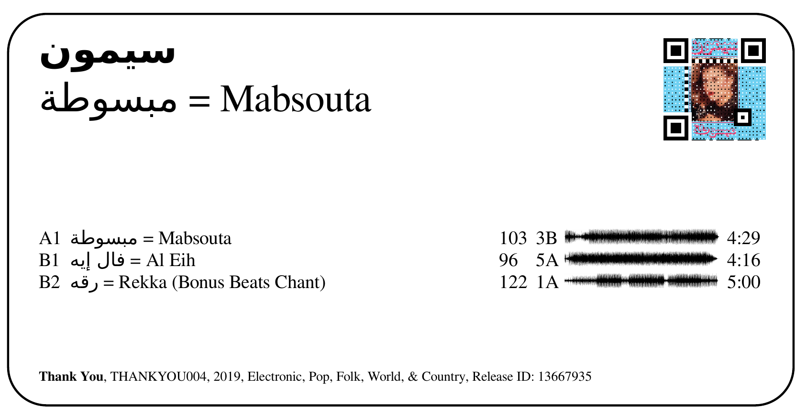
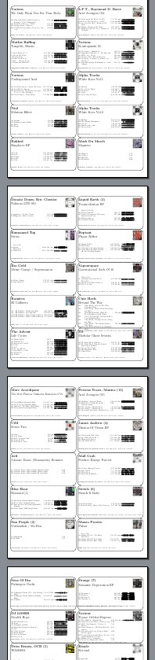
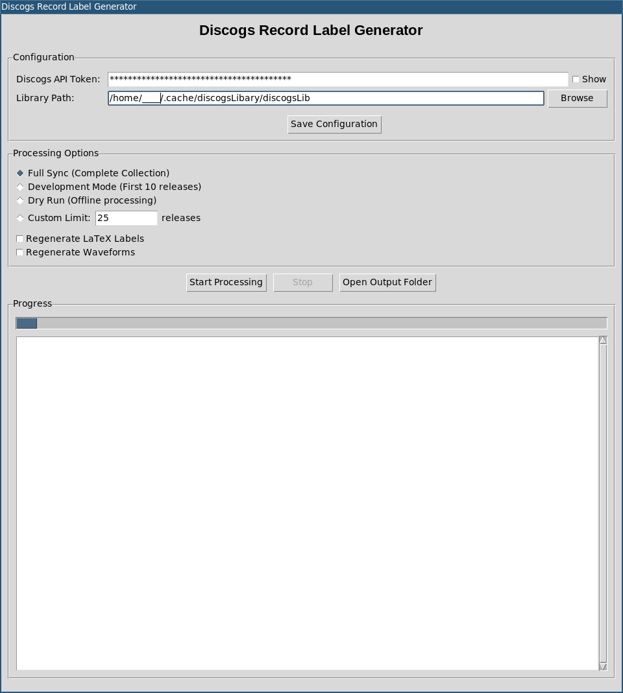

# DiscogsRecordLabelGenerator

A Python application that syncs your Discogs collection, analyzes tracks, and generates printable vinyl record labels.

### Preview





## What it does

1. **Downloads your Discogs collection** via the Discogs API
2. **Matches tracks to YouTube videos** for audio analysis  
3. **Analyzes audio files** using Essentia (BPM, key detection, spectrograms)
4. **Generates waveform images** with gnuplot
5. **Creates QR codes** (both plain and fancy with cover art backgrounds)
6. **Creates printable labels** in PDF format using LaTeX

## Quick Start

### Option 1: GUI (Recommended for beginners)
```bash
python3 gui.py
```
Use the graphical interface to configure your Discogs token and library path, then start processing with a click!



### Option 2: Command Line
```bash
python3 main.py --dev  # Process first 10 releases
```

## Requirements

### External Tools (must be in $PATH)
- `ffmpeg` - Audio processing
- `xelatex` - PDF generation (XeLaTeX for Unicode support)
- `gnuplot` - Waveform generation (optional but recommended)

### Python Libraries
```bash
pip install discogs_client yt-dlp essentia pandas rapidfuzz scipy matplotlib tqdm segno
```

## Setup

### 1. Install Python Dependencies
```bash
pip install discogs_client yt-dlp essentia pandas rapidfuzz scipy matplotlib tqdm segno
```

### 2. Install External Dependencies

**Windows:**
1. Install [Python 3.8+](https://python.org/downloads)
2. Install [FFmpeg](https://ffmpeg.org/download.html) and add to PATH
3. Install [MiKTeX](https://miktex.org/) or [TeX Live](https://tug.org/texlive/) for XeLaTeX
4. Install [gnuplot](http://www.gnuplot.info/) (optional)

**macOS:**
```bash
brew install ffmpeg mactex gnuplot
```

**Ubuntu/Debian:**
```bash
sudo apt update
sudo apt install ffmpeg texlive-xetex gnuplot python3-pip
```

**Arch Linux:**
```bash
sudo pacman -S ffmpeg texlive-core texlive-bin gnuplot python-pip
```

**CentOS/RHEL/Fedora:**
```bash
sudo dnf install ffmpeg texlive-xetex gnuplot python3-pip
```

### 3. Get Discogs API Token

1. Go to https://www.discogs.com/settings/developers
2. Generate a personal access token
3. Use the GUI (`python3 gui.py`) to configure it, or manually create the config file

### 4. Configuration

The application requires two configuration values:

- **`DISCOGS_USER_TOKEN`**: Your personal Discogs API token (get it from step 3 above)
- **`LIBRARY_PATH`**: Local filesystem path where the program will store all downloaded metadata, audio files, analysis data, and generated labels. Each release will have its own subdirectory here.

**Option A: GUI Configuration (Easy)**
```bash
python3 gui.py
```
Enter your token and select library folder in the interface.

**Option B: Manual Configuration**
Run this command to create and edit the config file:
```bash
mkdir -p ~/.config/discogsDBLabelGen && cat > ~/.config/discogsDBLabelGen/discogs.env << 'EOF'
{
  "DISCOGS_USER_TOKEN": "your_discogs_token_here",
  "LIBRARY_PATH": "/path/to/your/music/library"
}
EOF
```
Replace `your_discogs_token_here` and `/path/to/your/music/library` with your actual values.

## Usage

### GUI Mode (Recommended)
```bash
python3 gui.py
```
The GUI provides:
- Easy configuration management
- Processing mode selection (Full/Dev/Dry Run/Download Only/Generate Labels Only/Custom)
- Real-time progress monitoring
- One-click processing
- Label generation from existing releases

### Command Line Mode
```bash
# Full collection sync
python3 main.py

# Development mode (first 10 releases only)
python3 main.py --dev

# Dry run (offline processing of existing releases)
python3 main.py --dryrun

# Download-only mode (sync and download without analysis)
python3 main.py --download-only

# Download-only with development mode
python3 main.py --download-only --dev

# Custom limit (e.g., first 25 releases)  
python3 main.py --max 25

# Regenerate labels only
python3 main.py --regenerate-labels

# Regenerate waveforms only
python3 main.py --regenerate-waveforms
```

### Generate Printable Labels
```bash
# Generate labels for all releases
python3 generate_labels.py

# Generate first 10 releases for testing
python3 generate_labels.py --max 10

# Custom output directory
python3 generate_labels.py --output ~/my_labels
```

## File Structure

Each release creates a folder:
```
{release_id}_{release_title}/
├── metadata.json              # Discogs metadata
├── cover.jpg                  # Primary album artwork
├── cover_2.jpg, cover_3.jpg...# Additional cover images (if available)
├── qrcode.png                 # Plain QR code linking to Discogs
├── qrcode_fancy.png          # Fancy QR code with cover art background
├── yt_matches.json           # YouTube matches
├── A1.opus, A2.opus...       # Audio files
├── A1.json, A2.json...       # Analysis data (BPM, key, etc.)
├── A1_waveform.png...        # Waveform images for labels
└── label.tex                 # LaTeX label snippet
```

## Configuration Template

Save this as `~/.config/discogsDBLabelGen/discogs.env`:
```json
{
  "DISCOGS_USER_TOKEN": "AbCdEfGhIjKlMnOpQrStUvWxYz1234567890",
  "LIBRARY_PATH": "$HOME/Music/DiscogsLibrary"
}
```

Replace `AbCdEfGhIjKlMnOpQrStUvWxYz1234567890` with your actual Discogs token and adjust the library path as needed.

## Label Output

The generated labels include:
- Track listing with BPM and musical key
- Waveform visualizations
- Release information (artist, title, label, year)
- Format optimized for 8163 shipping labels

## Troubleshooting

**Common Issues:**
- **"No module named 'essentia'"**: `pip install essentia`
- **"ffmpeg not found"**: Install ffmpeg and ensure it's in your PATH
- **"xelatex not found"**: Install a LaTeX distribution with XeLaTeX support (texlive/miktex)
- **LaTeX compilation errors**: Check for special characters in track titles
- **GUI won't start**: Ensure tkinter is installed (`sudo apt install python3-tk` on Ubuntu)
- **Permission errors**: Make sure the library path is writable

**Platform-Specific:**
- **Windows**: Use forward slashes `/` in paths, not backslashes `\`
- **macOS**: May need to install Xcode command line tools: `xcode-select --install`
- **Linux**: Some distributions require separate python3-tkinter package

## License

Open source software. See LICENSE file for details.