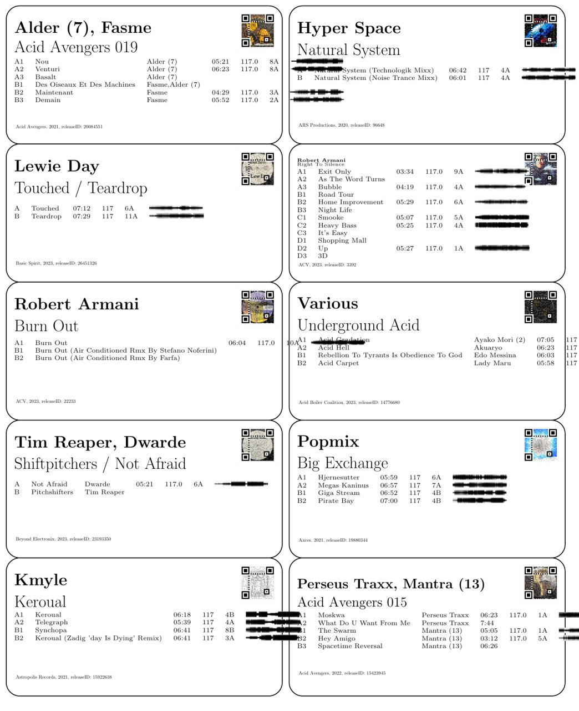

# DiscogsRecordLabelGenerator

## Overview

A comprehensive Python application for crawling Discogs music libraries and generating professional printable labels for vinyl record collections. The system integrates advanced music analysis, YouTube video matching, and LaTeX-based label generation.

## Features

### Music Analysis & Data Collection
- **Discogs API Integration**: Sync your complete Discogs collection
- **YouTube Video Matching**: Intelligent track-to-video pairing with fuzzy matching
- **Audio Analysis**: BPM, key detection, spectrograms, and MFCC analysis using Essentia
- **Waveform Generation**: Fast gnuplot-based waveform visualization for labels
- **Similarity Analysis**: Multi-dimensional audio feature comparison across your collection

### Label Generation
- **Professional Labels**: Generate 8163 shipping label format for home printing
- **LaTeX-Based**: High-quality typesetting with automatic sizing
- **Track Information**: Includes waveforms, BPM, key, and track details
- **Batch Processing**: Generate labels for entire collection or selected releases

### Performance Optimizations
- **Parallel Processing**: Concurrent YouTube metadata fetching and release processing
- **Intelligent Caching**: Skip re-downloading and re-analysis of existing files
- **Independent Analysis**: Waveform and audio analysis run separately for efficiency
- **Error Recovery**: Robust handling of failed downloads and API errors

## Quick Start

1. **Configuration**: Create config file at `~/.config/discogsDBLabelGen/discogs.env`
2. **Sync Collection**: `python3 main.py`
3. **Generate Labels**: `python3 generate_labels.py`

## Dependencies

### External Tools (required in $PATH)
- `ffmpeg` - Audio processing and format conversion
- `pdfLaTeX` - PDF generation from LaTeX templates  
- `gnuplot` - Fast waveform visualization (optional but recommended)

### Python Libraries
- `discogs_client` - Discogs API interaction
- `yt_dlp` - YouTube video downloading
- `essentia` - Music analysis and feature extraction
- `pandas` - Data manipulation for LaTeX tables
- `rapidfuzz` - String matching for track pairing
- `scipy` - Optimization algorithms
- `segno` - Modern QR code generation
- `matplotlib` - Plotting and waveform visualization

## Installation & Setup

1. **Clone Repository**
   ```bash
   git clone https://github.com/LahmacunLove/DiscogsRecordLabelGenerator.git
   cd DiscogsRecordLabelGenerator
   ```

2. **Install Dependencies**
   ```bash
   # Install Python packages
   pip install discogs_client yt-dlp essentia pandas rapidfuzz scipy segno matplotlib

   # Install external tools (Ubuntu/Debian)
   sudo apt install ffmpeg texlive-latex-extra gnuplot
   ```

3. **Configuration**
   Create config file at `~/.config/discogsDBLabelGen/discogs.env`:
   ```json
   {
     "DISCOGS_USER_TOKEN": "your_discogs_token_here",
     "LIBRARY_PATH": "~/Music/DiscogsLibrary"
   }
   ```

4. **Get Discogs Token**
   - Go to your Discogs profile settings
   - Generate a personal access token
   - Add it to your config file

## Usage

### Sync Your Collection
```bash
# Download and analyze your entire collection
python3 main.py

# Process a single release for testing
# (edit main.py to use sync_single_release(release_id))
```

### Generate Labels
```bash
# Generate all labels
python3 generate_labels.py

# Test with first 10 releases
python3 generate_labels.py --max 10

# Custom output directory
python3 generate_labels.py --output ~/my_labels

# Help and options
python3 generate_labels.py --help
```

### Analyze Similarities
```bash
# Find similar tracks in your collection
python3 similarity_analyzer.py
```

## File Structure

Each release creates a folder with:
```
{release_id}_{release_title}/
├── metadata.json              # Complete Discogs metadata
├── cover.jpg                  # Album artwork
├── yt_matches.json           # YouTube video matches
├── A1.opus, A2.opus...       # Audio files
├── A1.json, A2.json...       # Essentia analysis data
├── A1_waveform.png...        # Waveform visualizations
└── label.tex                 # LaTeX label snippet
```

## Platform Compatibility

Primarily developed and tested on Linux. Should work on any Unix-like system with the required dependencies installed. Performance optimizations make it suitable for large collections (500+ releases).

## Performance Notes

- **Parallel Processing**: YouTube metadata fetching is now 2-3x faster
- **Smart Caching**: Only processes new or missing data
- **Background Processing**: Suitable for overnight runs on large collections
- **Rate Limiting**: Respects Discogs API limits to prevent throttling

## Output Example



## License

This project is open source software. See LICENSE file for details.

## Contributing

Pull requests and issues welcome! Areas for contribution:
- Additional audio analysis features
- Label design improvements
- Performance optimizations
- Cross-platform compatibility